# Amazon Rekognition

This repository contains a collection of Jupyter notebooks that walks you through various APIs of Amazon Rekognition.

## Learning Objectives

* Learn about various Amazon Rekognition APIs including Labels, Moderation Labels, Faces, Text etc.

## Modules

## Create SageMaker Notebook Instance

In this step we will create a SageMaker Notebook instance using CloudFormation template. SageMaker is not required to use Rekognition, but we will use SageMaker as IDE for quick prototyping and to learn various Rekognition APIs.

1. Click on one of the buttons below to launch CloudFormation template in an AWS region.

Region| Launch
------|-----
US East (N. Virginia) | 

2. Under Create stack, check the checkbox for "I acknowledge that AWS CloudFormation might create IAM resources with custom names" and click Create.

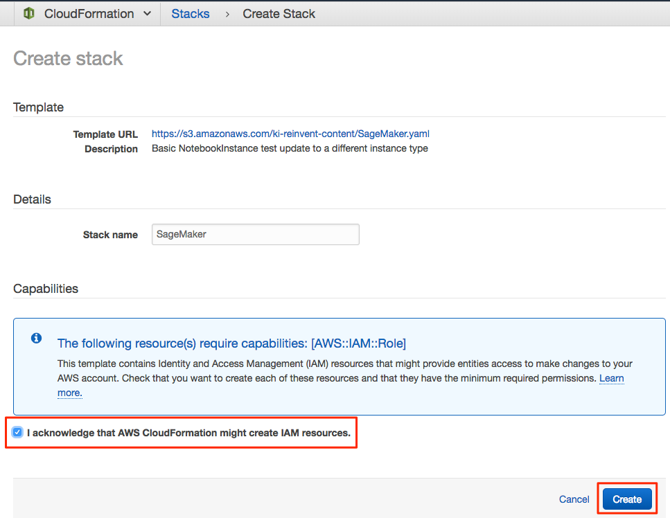

3. You should now see the screen with status CREATE_IN_PROGRESS. Click on the Stacks link in the top navigation to see current CloudFormation stacks.

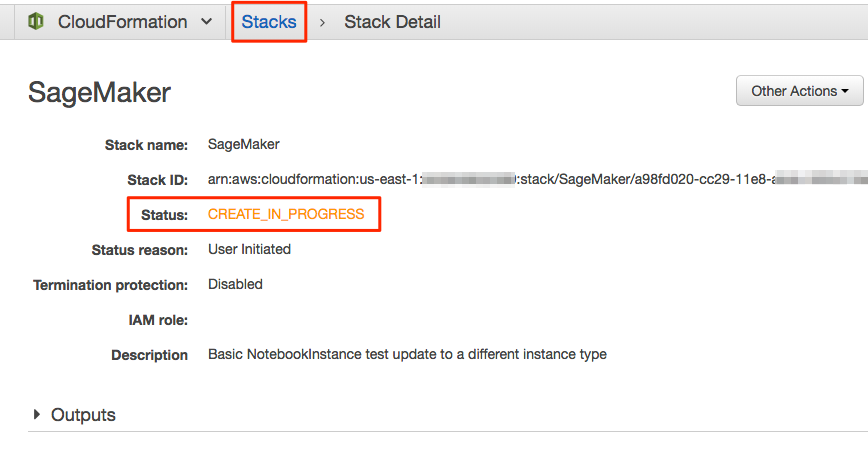

4. Click on the checkbox next to the stack to see additional details below.

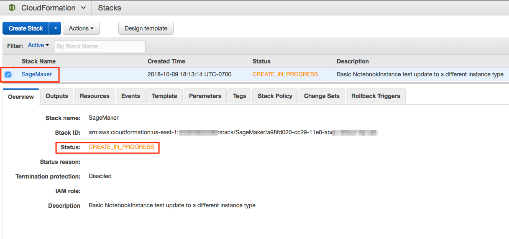

5. Wait until CloudFormation stack has the status CREATE_COMPLETE.

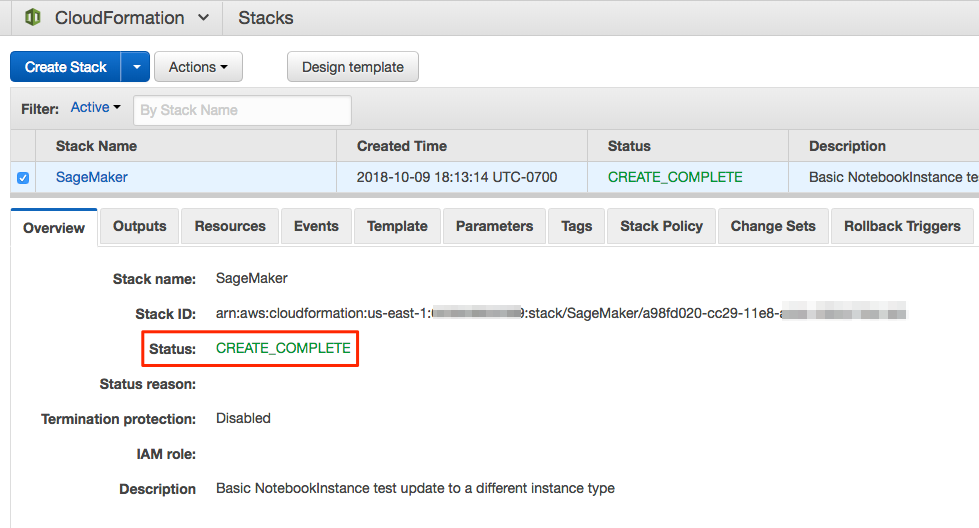

## Open SageMaker Notebook Instance

1. Go to SageMaker in AWS Console at https://console.aws.amazon.com/sagemaker/

2. Click on Notebook instances in the left navigation.

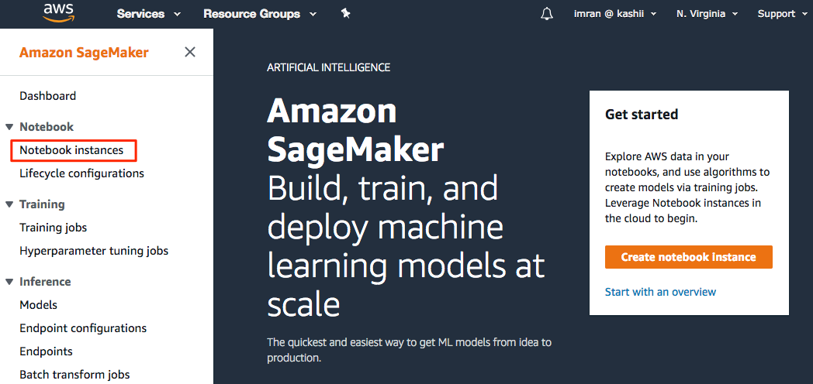

3.  You should see list of SageMaker instances. Click on the Open link next to the SageMaker instance.

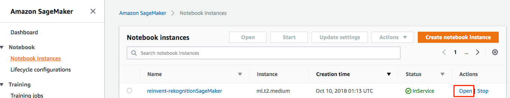

4. You will now be redirected to the Jupyter UI.

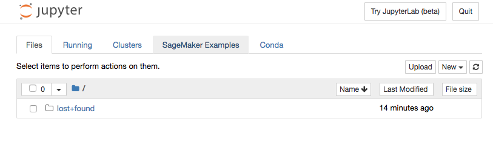

5. Click on New and then Terminal.

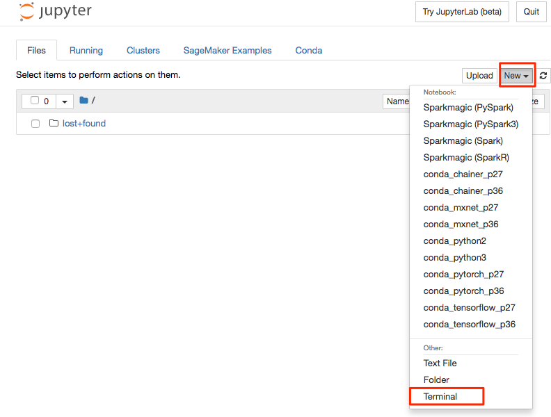

6. You should now see Terminal like below:

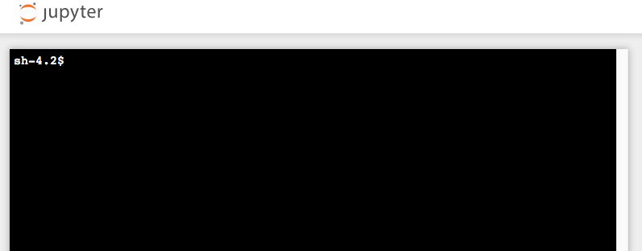

7. In the terminal type:
- cd SageMaker
- git clone https://github.com/darwaishx/rekognition-notebooks.git

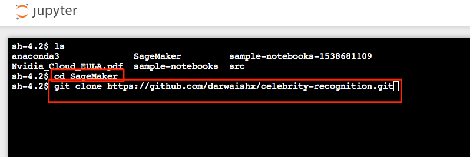

8. Go back to Jupyter home screen by clicking on the Jupyter logo on the top left and refresh to see the folder celebrity-recognition.

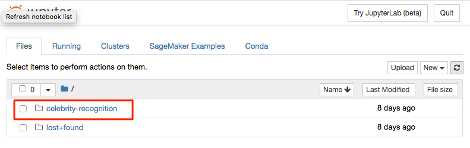

9. Click on celebrity-recognition, then 1-celebrity-recognition and then CelebrityRecognition.ipynb to open the notebook.

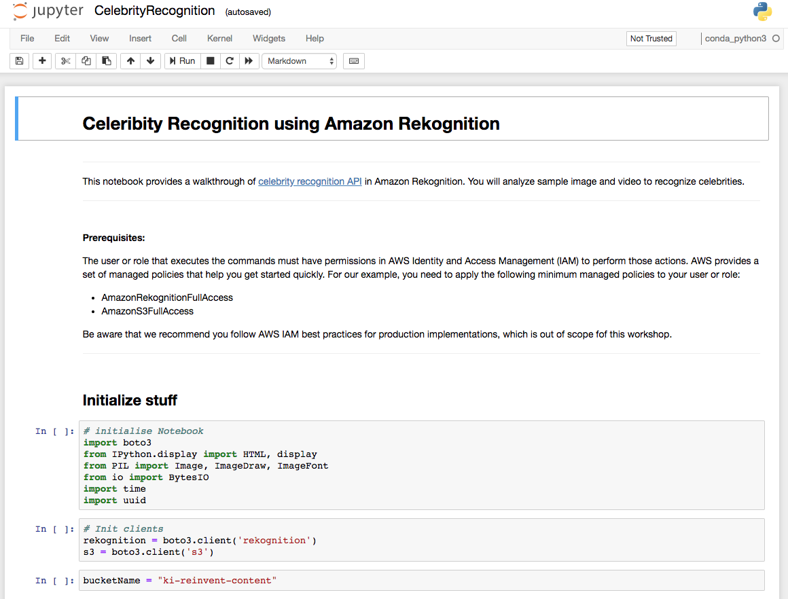

10. Follow the directions in the notebook to run each cell and review it's output.

## Cleanup
After you have completed the workshop, you can delete all of the resources using the following steps:
1. Delete all Lambda functions created manually
2. Delete all CloudFormation stacks created in the first module
